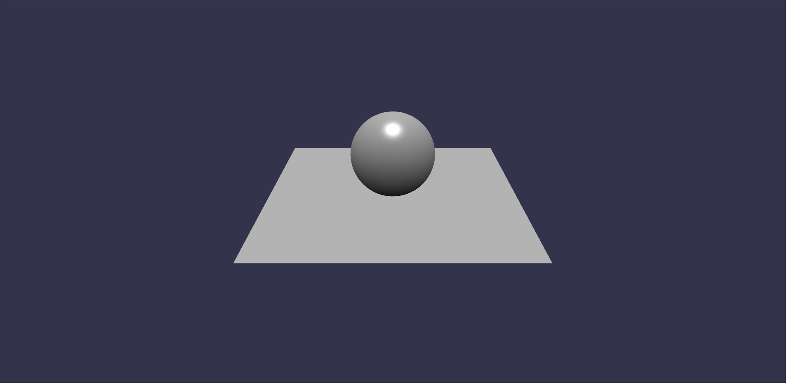

# End-to-End testing for WebGL / WebGPU applications



Rigorous testing of WebGL / WebGPU applications requires screenshot comparisons to validate shader outputs.

This repo is a minimal setup made from [Cosmos Journeyer](https://github.com/BarthPaleologue/CosmosJourneyer)'s own config. It uses [Playwright](https://playwright.dev/) to take screenshots and compare them to a baseline. Tests can be run in a docker container for ease of use in Github Action or locally if playwright does not support your OS.

## Writing tests

You can write end-to-end tests in `tests/e2e` using Playwright's API. You can have a look at `firstFrame.spec.ts` for an example of how to write a test.

Screenshots are stored in folders next to the test files.

## Run locally

To run the tests locally, you need to have [Node.js](https://nodejs.org/) installed.

Then, you can install the dependencies and run the tests:

```bash
npm ci
```

then install the playwright browsers:

```bash
npm run playwright install
```

Finally, you can run the tests:

```bash
npm run test:e2e
```

## Run in Docker

If you can't or don't want to setup playwright locally, you can run the tests in a docker container instead:

```bash
npm run test:e2e:docker
```
